## $ whoami

Aspiring SOC Analyst / Detection Engineer, building blue team skills through hands-on labs.
Open to remote roles.

## $ tail -f now.log

- Working through TryHackMe SOC Level 1 and TCM Security SOC 101
- Next: hands-on SIEM work, then the projects below

## $ ls ~/projects

- home-soc-lab: Elastic Stack SOC lab
- phishing-analysis: phishing email analysis reports
- siem-detection-rules: Splunk detection rules on the BOSS of the SOC datasets
- pcap-analysis: malware traffic PCAP analysis

_Repos land here as I build them._

## $ cat stack.txt

   

Training grounds: TryHackMe, TCM Security, LetsDefend, Blue Team Labs Online
